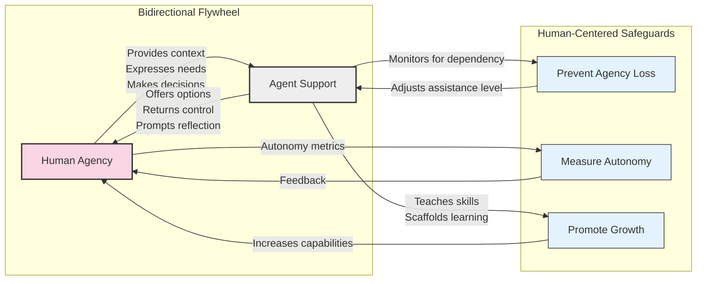

# Agent-Human Bidirectional Flywheel

This diagram illustrates a balanced approach to human-AI interaction designed to preserve and enhance human agency rather than diminish it through dependency.

## Key Concepts

1. **Bidirectional Adaptation**: Rather than a one-way service relationship, the system establishes mutual growth where both agent and human evolve through interaction.

2. **Agency Preservation**: The agent intentionally monitors for signs of human dependency and adjusts its support to maintain human autonomy.

3. **Skill Development**: Instead of solving problems for humans, the agent scaffolds learning experiences that build human capabilities.

4. **Measurement Framework**: The system includes mechanisms to measure human agency and autonomy to ensure the relationship remains beneficial.

Based on research by Mitelut et al. (2024) on "agency loss," Shen et al. (2024) on "bidirectional human-AI alignment," and Pedreschi et al. (2024) on recommendation systems' impact on human preferences.